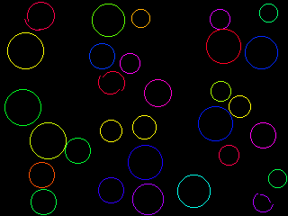
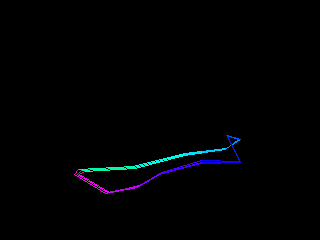
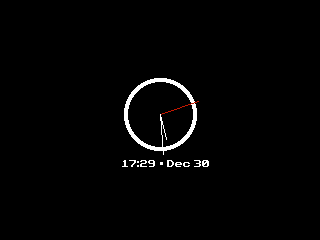
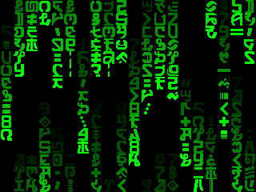
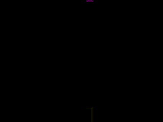
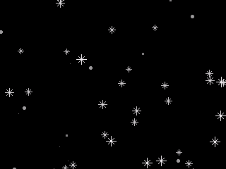
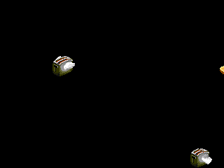
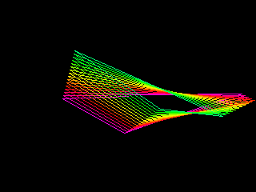
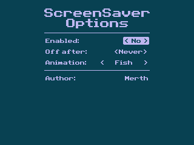

# ScreenSaver CE

ScreenSaver CE is a screensaver program for the TI-84 Plus CE. The program uses a hook which ties into TI's APD timer, so when it is enabled it will replace the TI-OS APD functionality.

## Animations

[](animations/baubles/) [](animations/beziers) [](animations/aod) [](animations/colors)
[](animations/fish) [](animations/matrix) [](animations/merth) [](animations/pipes)
[](animations/rain) [](animations/snow/) [](animations/spiral) [](animations/starfield/)
[](animations/strands) [](animations/tiles) [](animations/toasters) [](animations/triss)
[](animations/walk)

## Settings



## Installation

1. Download the latest version of ScreenSaver CE from the [GitHub releases page](https://github.com/EzCE/ScreenSaver-CE/releases/latest).
2. Send **SCRNSAVR.8xp** and **AppInstA.8xv**, along with any animations (found in the **Animations** directory) of your choice to your calculator using TI-Connect CE or TiLP. If you don't have the [CE C libraries](https://tiny.cc/clibs), you'll need to download and send those as well.
3. Run **prgmSCRNSAVR** to install the settings app.
4. Open **ScrnSavr** in the calculator's apps menu to enable the screensaver, change settings, or pick an animation.
5. You can preview screensaver animations before setting them using the preview button in the app.

## Creating animations

Creating your own animations is fairly straightforward. Start by cloning the repository (`git clone https://github.com/EzCE/ScreenSaver-CE`), then copy the template folder in the **animations** directory and rename it to the name of the animation you are adding.

Add your animation to the main project **makefile**:
```makefile
# Add to animations
animations:
	@$(MAKE) -C animations/<your directory> all

# Also add to clean
clean:
	@$(MAKE) -C animations/<your directory> clean

# Add to gfx if your animation has a gfx rule
gfx:
	@$(MAKE) -C animations/<your directory> gfx
```

In your the directory for your new animation, edit **makefile** and **asm/animation.asm** to include your animation's name and any author information.

The main loop for your animation should go in **src/animation.c**. Animations should exit if a key is pressed or if the user has enabled a timeout timer to perserve battery. The timeout timer is already handled by this code:
```C
if (utility_ChkAPDTimer()) {
    /*
        Put any clean up code you need to do here,
        such as gfx_End()
    */
    return 1;
}
```
(If the animation's main function returns anything other than 0, the hook will turn the calculator off rather than exiting back to the OS.)

To build animations, you'll need to [install the CE C Toolchain](https://ce-programming.github.io/toolchain/static/getting-started.html#installing-the-ce-toolchain).

To test your animation, you can use the **bin/output.8xp** file in your animation's directory produced when building with `make`.

To build the entire project (including all animations), you can also run `make` from the main project directory.
